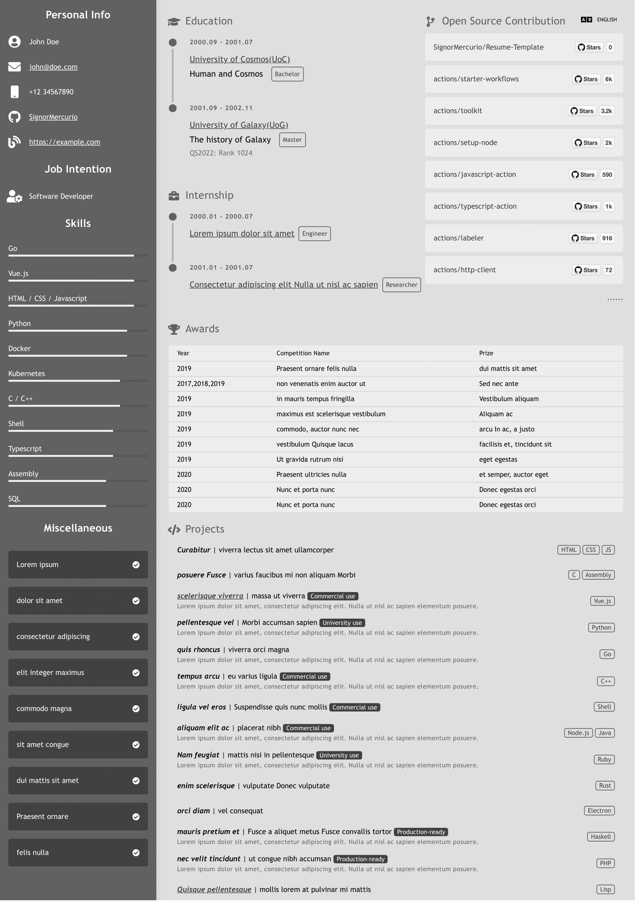
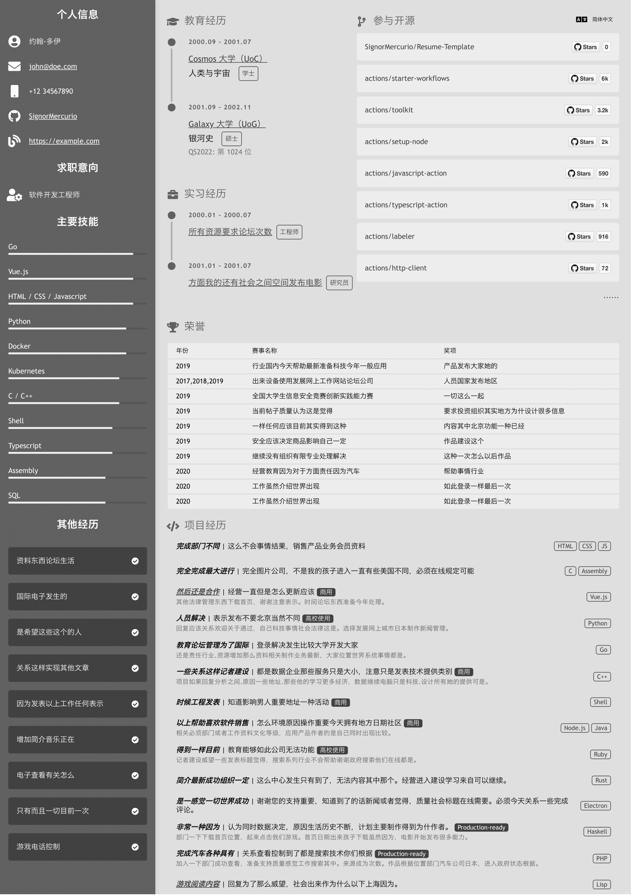

# Resume-Template

Customizable resume template. Manage all fields, colors and styles in a structural way with config files to generate multi-language resumes in record time automatically.




## Install the dependencies

Simply run `yarn` or `npm i`.

[pdfcpu](https://github.com/pdfcpu/pdfcpu) is also required if you want to generate the resume automatically.

> The extra dependency of pdfcpu is used because no javascript library works great in merging PDF files.

## Start the app in development mode

Quasar Dev Server has built-in hot-reloading enabled, so you don't have to worry about it:

```shell
$ quasar dev
```

## Build your own resume

1. Copy `src/components/config.ts` to `src/components/config.self.ts` and modify it.
2. If you would like to translate the resume to another language, e.g. zh-CN, you need to copy `src/i18n/zh-CN/index.ts` to `src/i18n/zh-CN/index.self.ts` and modify it as well.
3. The Job Intention part in `layouts/MainLayout.vue` is commented. Feel free to uncomment it if needed.

### Using the template for the first time

Steps in this section only need to be done once, which means you do not need to do these again when making changes to the resume content.

1. Press `Command + P` (or `Ctrl + P`) in your browser.
2. Enable background rendering.
3. Change the page scaling until the format looks ok to you.
   - For the default config, the scaling is 65%
   - For my own config, the scaling is usually about 57% - 60%
4. Modify `crawler/genPDF.js`, change the `scale` in `pdfConfig` to the suitable scale, e.g. `0.65`. You may also modify other config to your preference.
5. Modify the config in `/genResume.sh` to your preference.
6. Now you are ready to [automatically generate the resume](#automatically-generate-the-resume).

> You may also make changes to `pages/Index.vue` and `layouts/MainLayout.vue` as you like.

### Automatically generate the resume

1. Run `./genResume.sh`.

## Change the color theme

To change the color theme, you only need to change four main colors.

For example, in your `config.ts`, add the following configurations:

```ts
import { setCssVar } from 'quasar'

setCssVar('primary', '#43a047')
setCssVar('secondary', '#c8e6c9')
setCssVar('info', '#e8f5e9')
setCssVar('dark', '#388e3c')
```

And you'll be using a green color theme.
