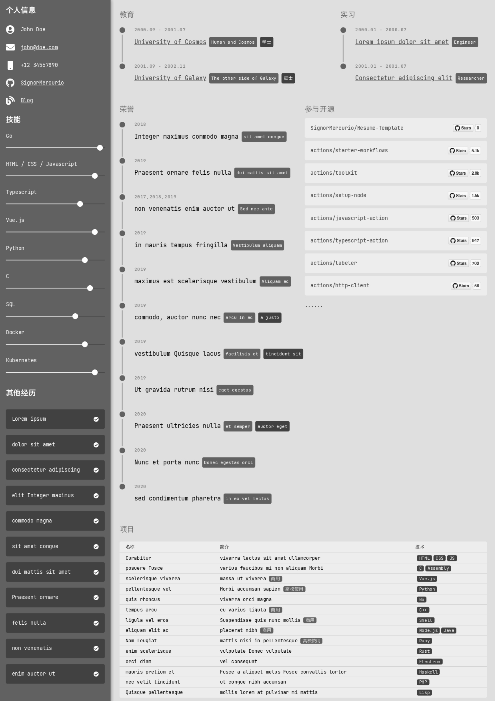
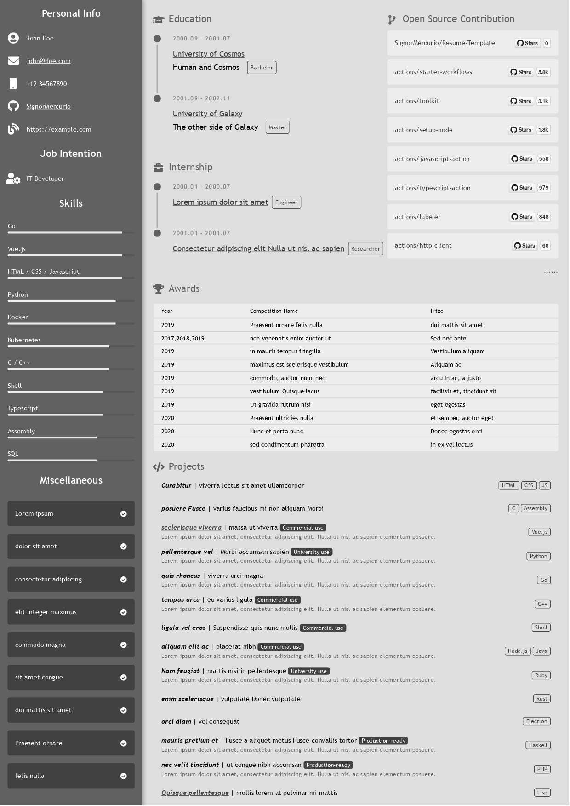

# Resume-Template

My personal resume template.





## Install the dependencies

Simply run `yarn` or `npm i`.

## Start the app in development mode

Quasar Dev Server has built-in hot-reloading enabled, so you don't have to worry about it:

```bash
quasar dev
```

## Build your own resume

1. Modify `src/components/config.ts`
2. Press `Command + P` (or `Ctrl + P`) in your browser
3. Enable background rendering
4. Scale the page until the format looks ok to you (for me, the scaling is usually about 57% - 60%)

If not, you may change `pages/Index.vue` and `layouts/MainLayout.vue` yourself.

## Change the color theme

To change the color theme, you only need to change four main colors.

In your `config.ts`, add the following configurations:

```ts
import { setCssVar } from 'quasar'

setCssVar('primary', '#616161')
setCssVar('secondary', '#e0e0e0')
setCssVar('info', '#eeeeee')
setCssVar('dark', '#424242')
```

And you'll be using the grey color theme.
